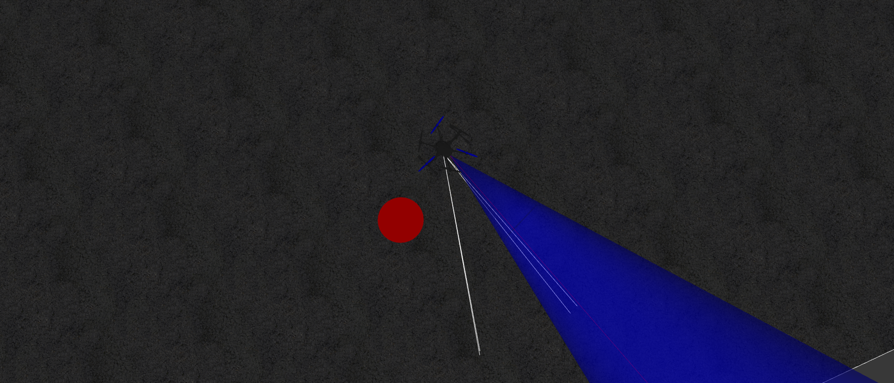
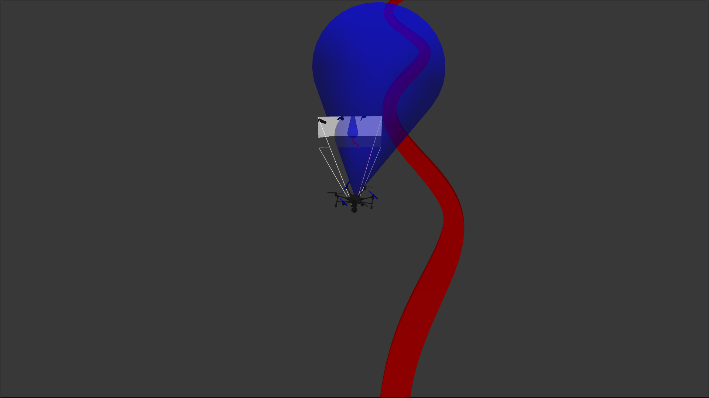

# UAS Software Subteam Onboarding Project Guidelines

This is an optional project for members to complete in order to famarialize themselves with the computer vision and flight software topics covered over previous workshops. Although it is not required to work on future projects, it is heavily recommended.

## Guidelines
There are three different tasks to this project that members must have the drone complete. Each task is similar to but also noticibly more difficult than the last. Although, code from previous tasks can be used and will often be helpful for completing more difficult tasks.

Feel free to use any functions within the MAVSDK-Python Library and any additonal libraries with any method to succeed in the specified tasks.

## Tasks
### Centering and Hovering Over Circle 

In this task the drone spawns next to a red circle of which the drone must center on while in the air. Use and adapt the Week 1 OpenCV workshop color detection code in order to determine the offset of the drone and the red circle. Use this offset in your flight code to adjust the drone accordingly. Use a flask server to communicate images and offsets sent and recieved by flight/vision code. 

Once the drone is directly over the circle, the drone will land.

The world name is "red_circle".

### Following a Curvy Path

In this task the drone spawns onto a long continous curvy path of which the drone must navigate to the end of. Similarily to the last task, use a vision server to analyze images sent by flight code to move along the path and adjust during curves.

Once the drone reaches the end of the line, it will land.

The world name is "path".

### Following a Moving Circle

In this final task, the drone spawns near a red circle continously moving in a circle. The drone must take off and begin to follow the red circle when it comes into view again. The drone will continue to follow the red circle for an indefinite amount of time while trying to stay centered over it at all times.

The world name is "moving_circle".
## Real World Tests
After successfully writing scripts that can execute these tasks in the simulation, they will be tested during the onboarding project fly day on real drones (with an exception of the moving circle task). More information about the fly day will be released in the future.
